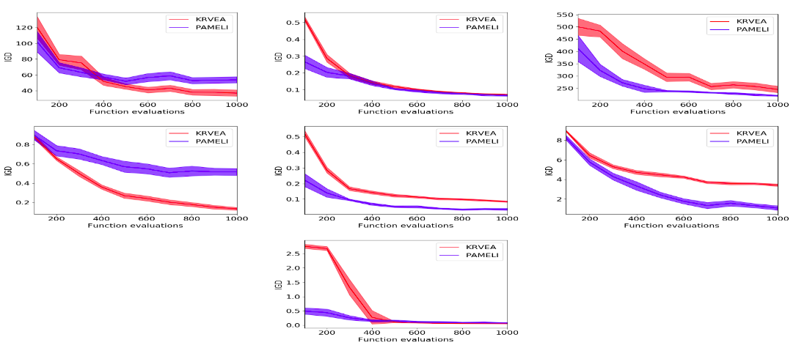
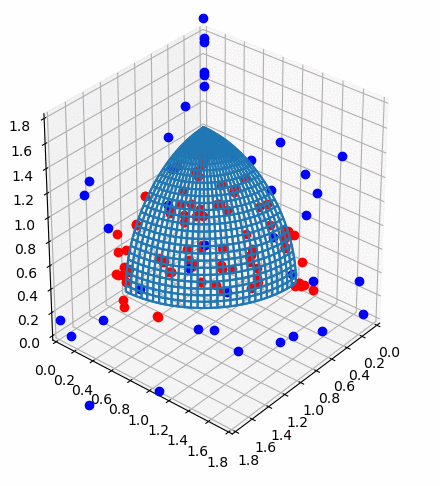

This is the author's implementation of the PAMELI algorithm proposed in [PAMELI: A Meta-Algorithm for Computationally Expensive Multi-Objective Optimization Problems]() (pending publication).

## Dependencies:

Known:

* PyTorch 1.3.0
* Numpy 1.17.5
* Scikit-learn 0.22.1
* Pygmo 2.13.0
* PyDOE 0.3.8

## Usage example:

`cd` to the directory of the repository and run:

`python run.py --problem <PROBLEM_NAME>`

In the current implementation you can use any of the DTLZ and WFG problems. For example, to test on DTLZ2:

`python run.py --problem DTLZ2`

## Results
PAMELI vs. [K-RVEA](https://ieeexplore.ieee.org/document/7723883) on the DTLZ problem set (from left to right and from top to bottom: DTLZ1, DTLZ2, DTLZ3, DTLZ4, DTLZ5, DTLZ6 and DTLZ7). The curves show the evolution of the inverted generational distance (IGD) with respect to the number of objective function evaluations: 

Evolution for 10 iterations of the approximated Pareto set on the DTLZ2 problem:

